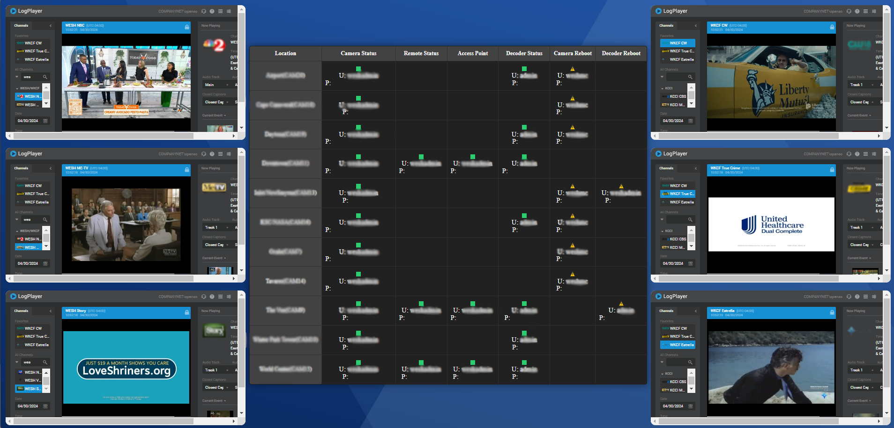

# BOI (BroadcastOps Interface)
BOI is a web-based interface for monitoring the connectivity status of various devices. It provides a visual representation of the network status of remote live-feed cameras, with the ability to directly manage these devices through the interface.
The system updates in real-time, ensuring that the status information is current. This setup can be used for network administration in environments where real-time monitoring of device statuses is critical.

## Installation
Ensure XAMPP is running with both Apache and MySQL modules activated for the interface to operate properly.

## Screenshot
This is a iteration I use for my personal work flow.


## Usage
Edit the array to add IP addresses and credentials, and remove any of the objects you won’t be using.
```php
{       
                name: '3',
                ip: 'ip_here',
                user: 'user',
                pass: 'pass',
                remoteIp: ' ',
                remoteUser: ' ',
                remotePass: ' ',
                apIp: ' ',
                apUser: ' ',
                apPass: ' ',
                decoderIp: '123.123.123.123',
                decoderUser: 'user',
                decoderPass: 'pass',
                cameraRebootIP: '123.123.123.123',
                cameraRebootUser: 'user',
                cameraRebootPass: 'password',
                decoderRebootIP: '',
                decoderRebootUser: '',
                decoderRebootPass: ''
            }
```

Be sure to update the functions that rely on IP status retrievals, such as adding the item to the function pingIPs.
```php
function pingIPs() {
            cameras.forEach(camera => {
                updateText(camera.ip);
                updateText(camera.remoteIp);
                updateText(camera.apIp);
                updateText(camera.decoderIp);
            });
        }
```

You can edit the retrieval time (currently set at 5 seconds).
```php
setInterval(pingIPs, 5000);
```

## Contributing
Feel free to use the layout as you see fit. If you have any suggestions or improvements, go ahead and submit an issue or pull request.

## License
[MIT](https://choosealicense.com/licenses/mit/)
